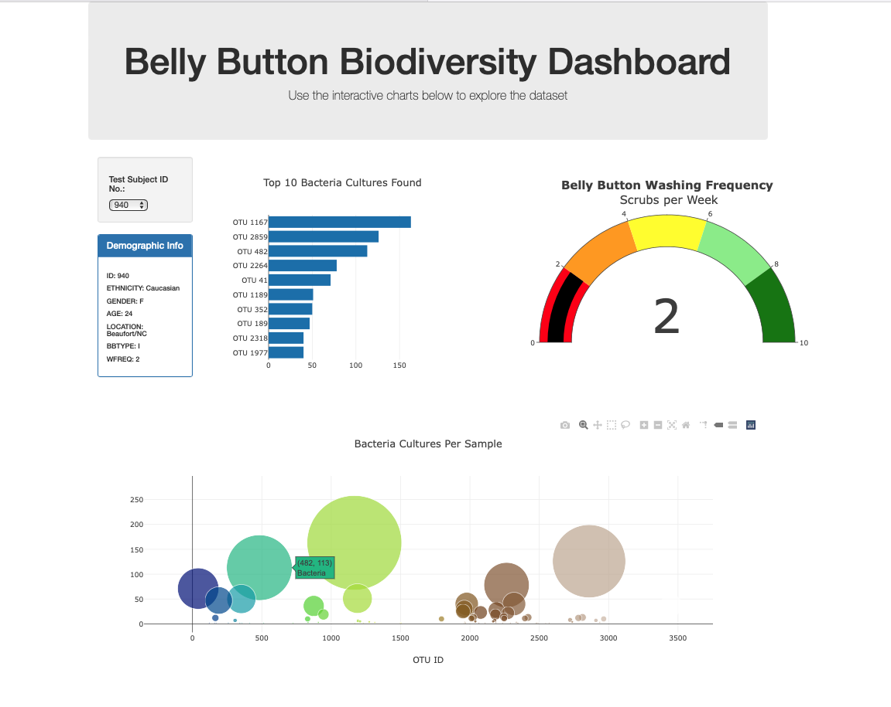
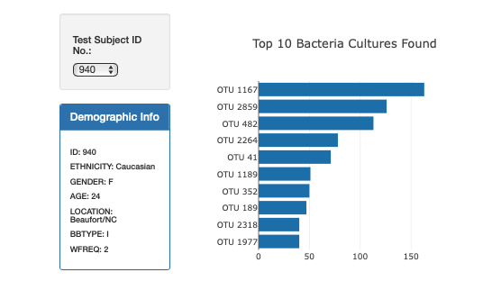
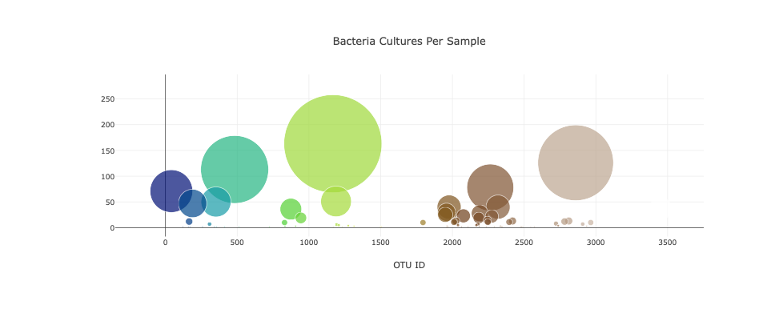
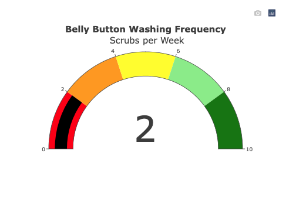

# Plotly_Biodiversity

Plotly and Belly Button Diversity

## Purpose 

Using Bacterial data collected from volunteers ,the goal is to complete a dashboard panel with information to share with everyone

The purpose of this project is to create a dynamic panel that includes demographic information and bacterial data for each volunteer. The analysis includes 3 charts: Bar chart that displays the top 10 bacteria cultures found in the belly button, a Buuble chart that diaplays the amount of bacteria cultures per sample and Gauge chart indicates the number of times a volunteer washes his/her belly button.

## Results 

### Graphs created with Plotly

1. Horizontal Bar Graph 

2. Bubble plot

3. Gauge Chart 

